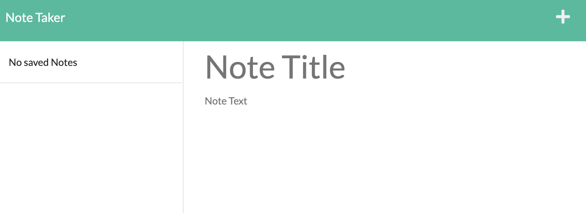

# Note Taker


## Description
This application allows users to add notes, view existing notes, and delete notes.  The program makes API calls to the backend storage files to retrieve existing notes so once a user saves a note it will remain available until the user decides to delete it.

Highlights for this project:
- Use of Express.js to create a server and API calls to retrieve note related data
- Modularization of API routes to create clean file structure
- Use of fs and util packages to read, write, append, and delete data from the backend files
- Heroku to showcase the application

## Table of Contents
- [User Story](#user-story)
- [Installation](#installation)
- [Usage](#usage)
- [License](#license)
- [Contributing](#contributing)
- [Tests](#tests)
- [Demo](#demo)
- [Deployed Application](#deployed-application)
- [Questions](#questions)

## User Story

```
AS A small business owner
I WANT to be able to write and save notes
SO THAT I can organize my thoughts and keep track of tasks I need to complete
```
## Installation
To download this code and modify it, make sure you install the following:
- Node.js
- Express.js
- NPM uuid package


## Usage




## License
This application is covered under the [License: MIT](https://opensource.org/licenses/MIT).


## Contributing
Resources from this project:
- Node.js
- Express.js
- HTML
- CSS
- Javascript
- Bootstrap
- Font Awesome


## Tests
Access the live application to test adding, viewing, and removing notes.

## Demo


## Deployed Application
🚀 [Link to the Deployed Application]()


## Questions
Contact Details:

- GitHub profile: [mel-ificent](https://github.com/mel-ificent)
- For additional questions, you can contact me via email: melissadonato11@gmail.com